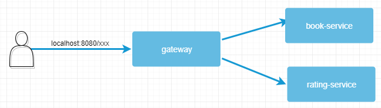

### This project is from the tutorial 
###[Spring Cloud – Bootstrapping](https://www.baeldung.com/spring-cloud-bootstrapping)


Project `config` needs a git repository located in `file://${user.home}/application-config` folder. Under this folder create the followings properties files:

discovery.properties:
```$xslt
spring.application.name=discovery
server.port=8082

eureka.instance.hostname=localhost

eureka.client.serviceUrl.defaultZone=http://localhost:8082/eureka/
eureka.client.register-with-eureka=false
eureka.client.fetch-registry=false
```

gateway.properties:
```$xslt
spring.application.name=gateway
server.port=8080

eureka.client.region = default
eureka.client.registryFetchIntervalSeconds = 5

# zuul.routes.APPLICATIONNAME.path  set the path of the service, here we set the path as "/book-service" url
zuul.routes.book-service.path=/book-service/**
zuul.routes.book-service.sensitive-headers=Set-Cookie,Authorization
hystrix.command.book-service.execution.isolation.thread.timeoutInMilliseconds=600000

zuul.routes.rating-service.path=/rating-service/**
zuul.routes.rating-service.sensitive-headers=Set-Cookie,Authorization
hystrix.command.rating-service.execution.isolation.thread.timeoutInMilliseconds=600000

zuul.routes.discovery.path=/discovery/**
zuul.routes.discovery.sensitive-headers=Set-Cookie,Authorization
zuul.routes.discovery.url=http://localhost:8082
hystrix.command.discovery.execution.isolation.thread.timeoutInMilliseconds=600000
```

book-service.properties:
```$xslt
spring.application.name=book-service
server.port=8083

eureka.client.region = default
# Indicates how often(in seconds) to fetch the registry information from the eureka server.
eureka.client.registryFetchIntervalSeconds = 5
eureka.client.serviceUrl.defaultZone=http://localhost:8082/eureka/
```

rating-service.properties:
```$xslt
spring.application.name=rating-service
server.port=8084

eureka.client.region = default
eureka.client.registryFetchIntervalSeconds = 5
eureka.client.serviceUrl.defaultZone=http://localhost:8082/eureka/
```

Project `config` manages all configuration for our applications, we consolidate all of our configuration into a Git repository and connect it to the `config` project. Our projects are declared as a config-client, when projects start, it will automatically fetch configuration from config-server. 


Project `discovery` acts as a *Eureka-server*, it allows services to find and communicate with each other without hard coding hostname and port.
The *Eureka-server* is a *service registry*, all service has to register to it in order to talk with each other.


Project `gateway` acts as a reverse proxy shuttling request from clients to our back end servers.
 
